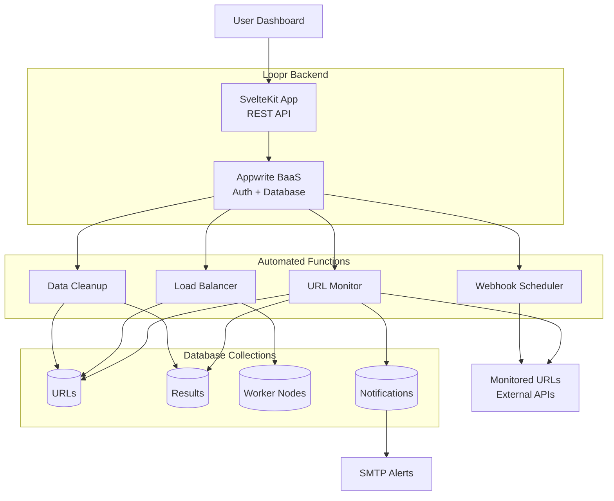

This is my first test blog. 

this is a simple python program:

```python
print("hello world")
for i in range(0, n):
    i += 1
```

this is a mermaid, asshole:



temp:
1. asd
2. sad
3. asss

> sdsadadasasd
> asdasdads
