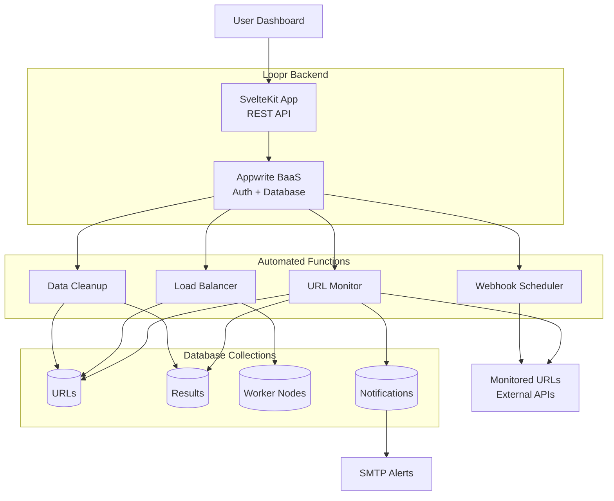

Welcome to my first blog post! As a backend developer and AIML enthusiast, I'm excited to share my journey and insights with you.

## Why Backend Development?

Backend development is the backbone of modern applications. It's where the magic happens - data processing, business logic, and system architecture all come together to create powerful, scalable solutions.

Here's a simple Python example that demonstrates basic server functionality:

```python
print("Hello, World!")
for i in range(0, 10):
    print(f"Processing request {i + 1}")
```

## System Architecture Overview

Let me show you how I typically structure backend systems:



# List

1. hola
2. hello
3. hi

# Quotes

> Testing the UI

# Table

| Header 1  | Header 2  | Header 3  |
|-----------|-----------|-----------|
| Row 1 Col 1 | Row 1 Col 2 | Row 1 Col 3 |
| Row 2 Col 1 | Row 2 Col 2 | Row 2 Col 3 |
| Row 3 Col 1 | Row 3 Col 2 | Row 3 Col 3 |


# Link

[link of something](https://anish-sarkar.com)